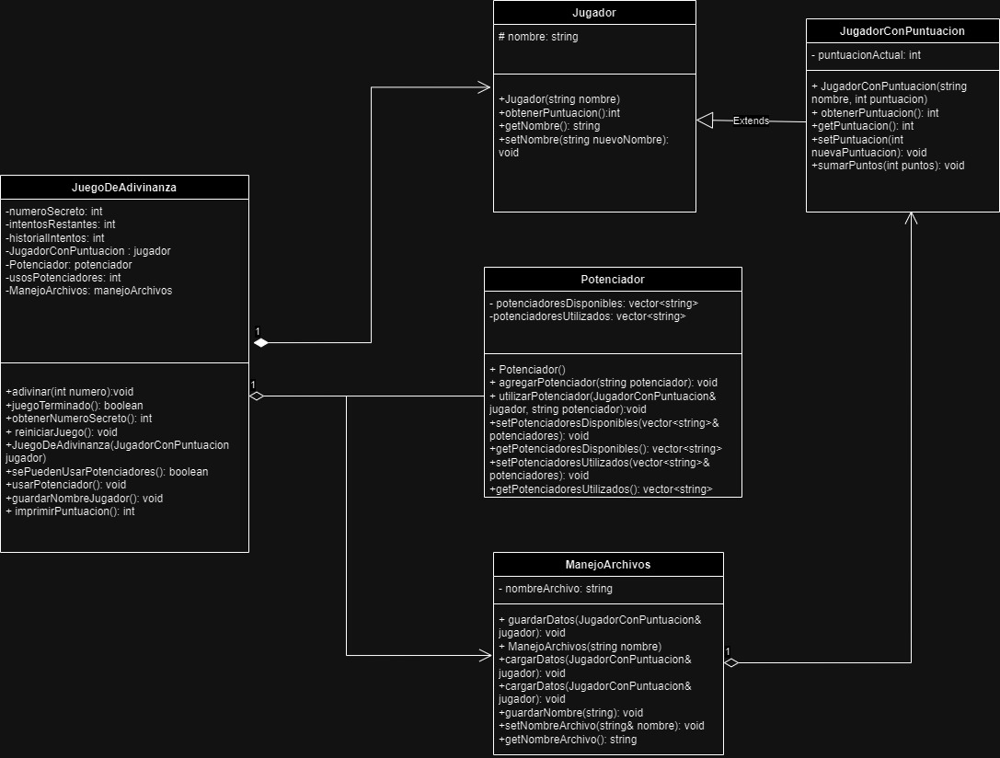

# AdivinaElNumero
Este proyecto se centra en la problematica del desarrollo del pensamiento critico dentro de las personas mediante el uso de juegos tal como la adivinanza. El pensamiento critico se entiende como la capacidad de analizar y evaluar la consistencia de los razonamientos, una habilidad que en la actualidad se esta volviendo cada vez más y más necesaria, esto ya que con el incremento de informacion que se distribuye alrededor del mundo la misma puede llegar a ser incorrecta o falsa lo que lleva a la toma de decisiones incorrectas. El publico objetivo de esta problematica se centra en niños menores de 8 años. Se escogio este público, ya que ellos estan empezando a desarrollar el pensamiento critico y un programa que impulse el crecimiento del mismo es de relevancia ya que contribuye a que lo desarrollen con una fuente de apoyo.  
 Realizo este proyecto, ya que para mi un juego de adivinanza es un metodo eficaz para fomentar el pensamiento critico, esto ya que mantiene el cerebro en constante pensamiento en busca de la respuesta correcta, y lo fomenta a querer continuar en busca de la verdad, algo con lo que se debe contar hoy en dia, ya que sin esto no se podria contar con la mayoria de las cosas con las que tenemos, por esto mismo decidi realizar este proyecto, para proporcionar una habilidad necesaria de una manera divertida y educativa.  
 Este programa consta de un minijuego el cual trata de adivinar un número secreto el cual el programa genera. El usuario consta de 5 intentos para responder de manera correcta de lo contrario el juego finaliza y se le pide al usuario si desea continuar, si responde con afirmacion, el programa vuelve a generar un nuevo número y el juego continua, sin embargo si el usuario responde lo contrario el programa cierra automaticamente. 

# Instrucciones de instalacion
1. Descarga los archivos .h y .cpp de este repositorio
2. Ubicar estos archivos en algun folder donde puedas recordar facilmente su ubicacion
3. En la terminal usar el comando cd para viajar a la ubicacion del archivo
4. En la terminal de consola escribir la siguiente linea de codigo: g++ AdivinaElNumero.cpp -o "Nombre de como quieras que se llame el ejecutable".exe
5. Para ejecutar el archivo desde la terminal, introducir en la linea de codigo el nombre de tu ejecutable, puede ser con el .exe final o no
6. Disfruta del juego
